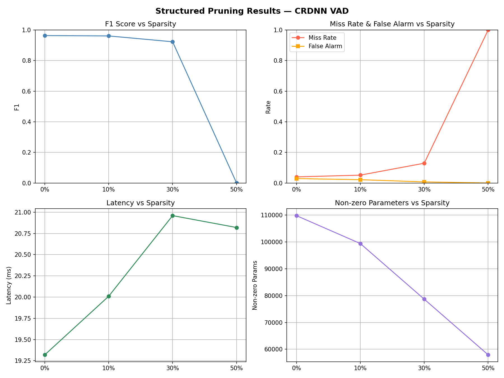

# Experimental Report — Structured Pruning on CRDNN VAD
## CS6140 Group 5 · Sub-Project: Model Compression via Pruning

---

## 1. 任务与动机

本实验对 SpeechBrain 官方预训练模型 [`speechbrain/vad-crdnn-libriparty`](https://huggingface.co/speechbrain/vad-crdnn-libriparty) 做剪枝压缩，目标是在 **尽量不损失 VAD 准确率（F1 / Miss Rate）** 的前提下，减少模型参数 / 推理耗时，探索在边缘设备上部署语音活动检测的压缩空间。

模型架构（CRDNN）：
- 两段 CNN blocks (`Conv2d ×4`)
- 2 层 双向 GRU (`hidden=32`)
- 2 层 全连接输出 (`Linear`)
- 总参数量 **109,744**，磁盘 0.44 MB

---

## 2. 方法

### 2.1 分层剪枝策略

PyTorch 的 `torch.nn.utils.prune` 对不同层有不同支持程度，因此本实验按层类型区分：

| 层类型   | 方法                  | 稀疏维度 | 备注 |
|---------|----------------------|---------|------|
| `Linear` | **Structured L1**   | 按输出 neuron (dim=0) | 可物理删除输出行，真正压缩计算 |
| `GRU`    | **Unstructured L1** | 权重元素级 | PyTorch 没有原生 recurrent structured pruning |
| `Conv2d` | **Unstructured L1** | 权重元素级 | 通道级剪枝需要重写下游 shape，暂归为 future work |

每次剪枝在 FP32 baseline 的 `copy.deepcopy` 副本上独立进行，确保不同稀疏度间结果相互独立。剪枝后立刻调用 `prune.remove()` 将 mask 写死到权重张量中。

### 2.2 Sparsity 扫描

选取 **10% / 30% / 50%** 三档，加上 baseline 共 4 个配置点。Linear 层的 structured pruning 由于只能删除整行，实际稀疏度略低于目标值（例如 10% 目标 → 9.46% 实际）。

### 2.3 评估指标

| 指标 | 说明 |
|------|------|
| **参数量 / Non-zero** | 衡量真实压缩比 |
| **Memory / Disk size** | 注意：`torch.save` 保留零权重，故磁盘大小不变；内存大小用 `numel × element_size` 估算 |
| **Latency** | 5 秒 dummy clip，重复 20 次取均值（CPU，单线程） |
| **Speech ratio** | 模型推理得到的语音占比 |
| **Frame-level F1 / Precision / Recall** | 10 ms frame，以 `get_speech_segments()` 输出为 pred，`eval.json` 中 ground-truth 区间为 gt |
| **Miss Rate / False Alarm** | VAD 常用错误率（MissR = 1 − Recall） |

### 2.4 数据集

**LibriParty eval split**：50 段会话，平均 ~4.8 分钟，包含多人对话、背景噪声、环境声；ground-truth 标签来自 `metadata/eval.json`，每个说话人独立列出 `start/stop` 区间，评估时取所有说话人区间的并集作为语音区间。

---

## 3. 实验结果

### 3.1 量化对比

| Model         | Target | Actual Sparsity | Params  | Non-zero | Latency (ms) | F1     | Precision | Recall | MissR  | FA     |
|---------------|--------|-----------------|---------|----------|--------------|--------|-----------|--------|--------|--------|
| FP32 Baseline | 0%     | 0.00%           | 109,744 | 109,744  | 19.32        | 0.9633 | 0.9675    | 0.9600 | 0.0400 | 0.0290 |
| Pruned 10%    | 10%    | 9.46%           | 109,744 | 99,357   | 20.01        | 0.9610 | 0.9751    | 0.9484 | 0.0516 | 0.0219 |
| Pruned 30%    | 30%    | 28.33%          | 109,744 | 78,657   | 20.96        | 0.9228 | 0.9907    | 0.8706 | 0.1294 | 0.0073 |
| Pruned 50%    | 50%    | 47.19%          | 109,744 | 57,960   | 20.82        | 0.0013 | 0.0600    | 0.0007 | 0.9993 | 0.0000 |

### 3.2 可视化



四格子图：
- **F1 vs Sparsity**：10%/30% 下仍接近 baseline，50% 悬崖式崩溃
- **MissR & FA vs Sparsity**：miss rate 单调上升，false alarm 反而下降（模型越来越"保守"直到完全不触发）
- **Latency vs Sparsity**：基本不变（20 ms 上下）。由于我们只是把权重置零而未真正删除行 / 用稀疏算子，CPU dense matmul 仍跑满所有元素
- **Non-zero Params**：线性下降，验证 sparsity 生效

---

## 4. 分析与讨论

### 4.1 为什么 10% 几乎无损？

CRDNN 虽然参数量不大 (110K)，仍有明显冗余，尤其是两层 output FC (`dnn1`, `dnn2`) 的神经元中有相当一部分权重接近零。10% 的 L1-threshold 主要砍掉这些低幅值权重，对决策边界影响极小。

### 4.2 为什么 50% 会完全坍塌？

50% 下观察到的 F1 = 0.0013、speech_ratio = 0%、miss_rate = 99.93%——模型几乎不再输出 "speech"。两个主要原因：

1. **GRU 剪枝的破坏性**：双向 GRU 是这个模型的时序建模核心。unstructured 剪枝 50% 的 recurrent weight 会破坏 hidden state 的传播，使输出 logits 趋于恒定，经过 sigmoid 后落在 activation threshold 之下。
2. **无 fine-tune**：本实验是 **one-shot prune-only**（没有 retrain / knowledge distillation recovery）。文献中通常 50% 稀疏度需配合 fine-tuning 才能保持精度。

### 4.3 Miss Rate vs False Alarm 的权衡

从 10% → 30% 可以观察到：miss rate ↑，false alarm ↓。这说明剪枝使模型输出更"保守"（倾向预测 silence）。在 VAD 应用中，若下游是 ASR 触发器，miss rate 的上升直接意味着漏触发——比 false alarm 影响更大。

### 4.4 Latency 没有下降的原因

三种剪枝方式在当前实现中均为 **权重置零**，而非真正重写层形状：
- Linear 层即便 structured，仍保留原 `in_features × out_features` 矩阵
- GRU / Conv 的 unstructured 剪枝本质上是 mask

要获得真实加速需要：
1. Linear：物理删除零行 + 调整下游 `in_features`
2. 使用稀疏矩阵算子（`torch.sparse`）或特定硬件（TensorRT, ONNX with sparsity support）

---

## 5. 结论与后续工作

**可带回的观察：**
- ✅ CRDNN VAD 在 **10% sparsity** 下基本无损 (F1 0.9633 → 0.9610)
- ⚠️ 30% 已显著影响 recall (0.96 → 0.87)；miss rate 是主要劣化指标
- ❌ 无 fine-tune 的 50% one-shot pruning 完全破坏模型
- ⚠️ 当前剪枝不带来 latency 改进，因为未做真实稀疏推理

**后续方向：**
1. **Prune + Fine-tune (iterative magnitude pruning)**：在每档 sparsity 后 fine-tune 1–2 epoch，预期 30% 可恢复到近 baseline
2. **KD-guided pruning**：把 baseline model 作为 teacher，剪枝后的模型作为 student，用 KL loss 恢复精度——与组里 KD 分支天然结合
3. **真 · 结构化剪枝**：对 GRU 做 hidden-dim 剪枝（需自定义实现），对 Conv 做 channel pruning + 下游 shape 重写，才能真正拿到 latency / memory 收益
4. **ONNX + 稀疏推理**：探索在真实边缘硬件（如树莓派）上对比 dense vs sparse 推理耗时

---

## 附录 · 复现命令

```bash
source .venv/bin/activate
python 04_pruning.py \
    --audio_dir data/LibriParty/dataset/eval \
    --label_dir data/LibriParty/dataset/metadata
```

生成物：
- `results/pruning_results.csv`
- `results/pruning_plots.png`

硬件：Apple Silicon（CPU 推理）。SpeechBrain 1.0.3 + PyTorch 2.5.1.
